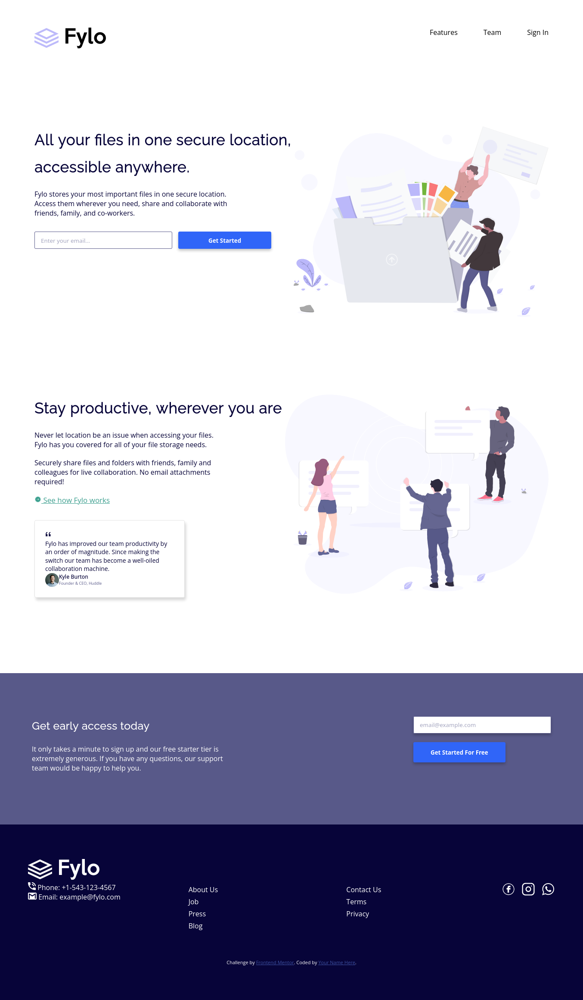

# Frontend Mentor - Fylo landing page with two column layout solution

This is a solution to the [Fylo landing page with two column layout challenge on Frontend Mentor](https://www.frontendmentor.io/challenges/fylo-landing-page-with-two-column-layout-5ca5ef041e82137ec91a50f5). Frontend Mentor challenges help you improve your coding skills by building realistic projects. 

## Table of contents

- [Overview](#overview)
  - [The challenge](#the-challenge)
  - [Screenshot](#screenshot)
  - [Links](#links)
- [My process](#my-process)
  - [Built with](#built-with)
  - [Useful resources](#useful-resources)
- [Author](#author)

## Overview

### The challenge

Users should be able to:

- View the optimal layout for the site depending on their device's screen size
- See hover states for all interactive elements on the page

### Screenshot

### Links

- Solution URL: [Repository](https://github.com/othimar/fylo_landing_page)
- Live Site URL: [Live site URL](https://othimar.github.io/fylo_landing_page/)

### Built with

- Semantic HTML5 markup
- CSS custom properties

### Useful resources

- https://codepen.io/sosuke/full/Pjoqqp
- [IconScout](https://iconscout.com)
  - [Facebook](https://iconscout.com/icons/facebook)
  - [Instagram](https://iconscout.com/icons/instagram)
  - [Whatsapp](https://iconscout.com/icons/whatsapp)
## Author

- Frontend Mentor - [@othimar](https://www.frontendmentor.io/profile/othimar)
- Twitter - [@OthimarPele](https://www.twitter.com/othimarpele)

